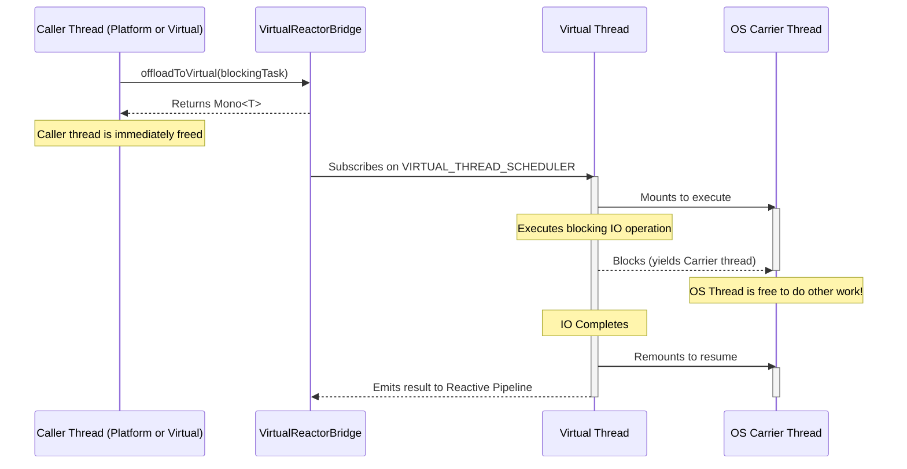
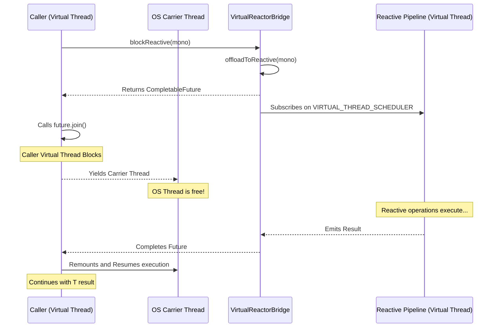
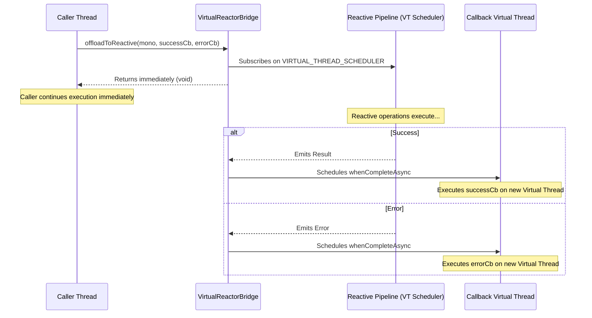

# Virtual Reactor Bridge

The `virtual-reactor-bridge` module provides utility methods to seamlessly bridge the gap between Java 21 Virtual Threads (imperative, blocking style) and Project Reactor (declarative, reactive style).

This document explains the conceptual mechanics, correctness, and non-blocking nature of the thread switches facilitated by `VirtualReactorBridge.java`.

## Core Concepts

### 1. The Executor and Scheduler
```java
private static final Executor VIRTUAL_THREAD_EXECUTOR = Executors.newVirtualThreadPerTaskExecutor();
private static final Scheduler VIRTUAL_THREAD_SCHEDULER = Schedulers.fromExecutor(VIRTUAL_THREAD_EXECUTOR);
```
The bridge integrates Java 21 Virtual Threads with Project Reactor optimally. `Executors.newVirtualThreadPerTaskExecutor()` guarantees that every task submitted to it runs on a new Virtual Thread. Since Virtual Threads are highly lightweight, managed by the JVM (they don't map 1:1 to OS threads), this is highly scalable. The Reactor `Scheduler` simply bridges this executor into the Reactive ecosystem.

## Thread Switching Diagrams

### Blocking Imperative to Reactive Switch
When you wrap standard, potentially blocking `Callable` operations and surface them as non-blocking Reactive streams:



**Correctness:** This correctly converts imperative blocking code to a non-blocking reactive stream without starving the system's OS threads. If the `blockingTask` performs a blocking IO operation, it "blocks" the Virtual Thread. However, in Java 21, blocking a Virtual Thread simply yields the underlying carrier OS thread back to the `ForkJoinPool` so it can execute other tasks.

---

### Reactive to Blocking Imperative Switch
When executing a Reactive pipeline and surfacing the result back to imperative code safely:



**Correctness:** The `blockReactive` method blocks efficiently if the current thread is a Virtual Thread. By calling `.join()` on the `CompletableFuture`, the current Virtual Thread will park and wait for the result, yielding the carrier OS thread. When the reactive pipeline finishes, the Virtual Thread resumes. This allows developers to write straightforward, imperative code (`T result = blockReactive(...)`) while maintaining the non-blocking performance of reactive systems underneath.

*(Note: If `blockReactive` is called from a standard Platform Thread, it will block the OS thread. This should be avoided on limited thread pools).*

### Asynchronous Execution Switch
For scenarios where you do not want to block at all and handle results via callbacks:



**Correctness:** This correctly handles execution without forcing the caller to block. Once the reactive pipeline yields a result, `whenCompleteAsync` schedules the consumer callbacks to execute on a brand new Virtual Thread (via `VIRTUAL_THREAD_EXECUTOR`), completely decoupling the completion processing from whatever thread the Reactor pipeline finished on.
